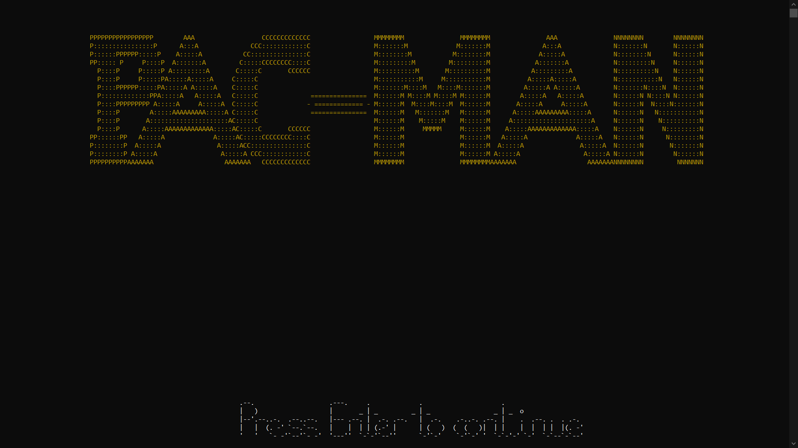
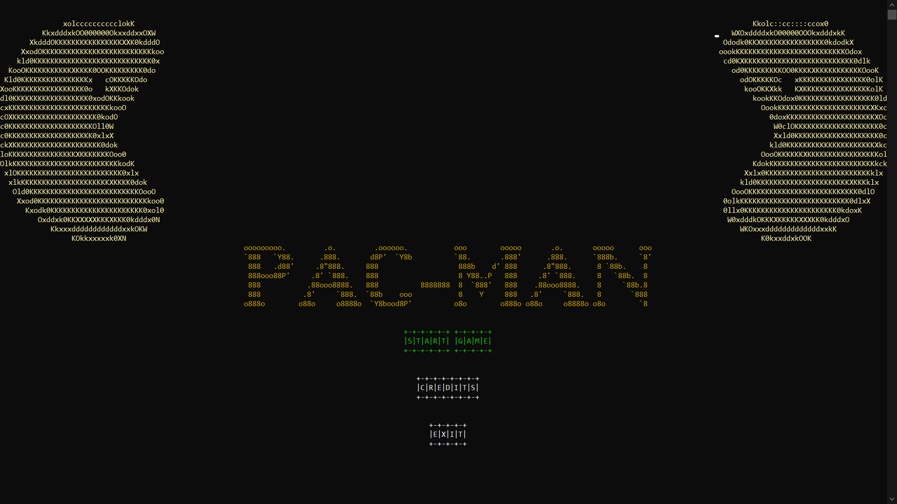
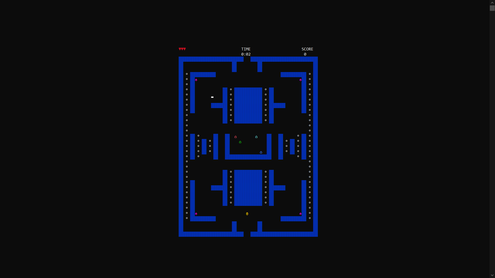

# simple-pac-man

Simple command-line based game project (Non - OOP styled) developed for 2nd Semi module 'CO1302 Programming for Engineers' using c++.

* Use **arrow keys** or **WASD** to move player
* Collect all points to finish level
* Use power-ups to eat ghost
* **Don't let the ghosts eat you !!!**

Screen-shots:

**Contributors**

* [Karthick47v2](https://github.com/Karthick47v2)
* [Gowreesan10](https://github.com/Gowreesan10)
* Senistan
* Kiruparan